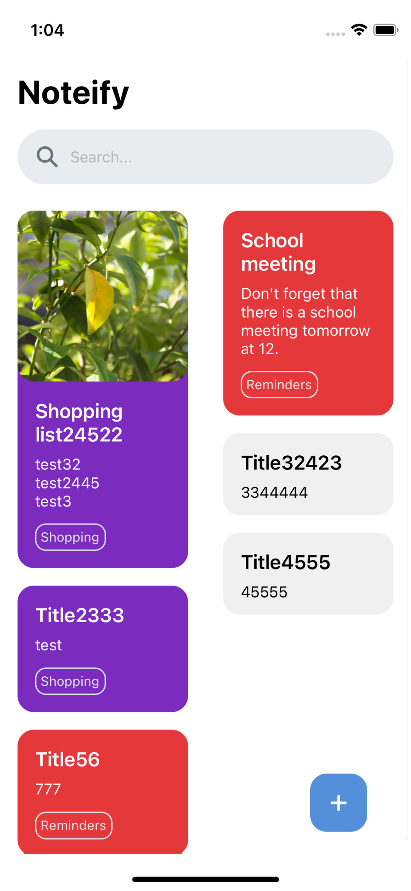
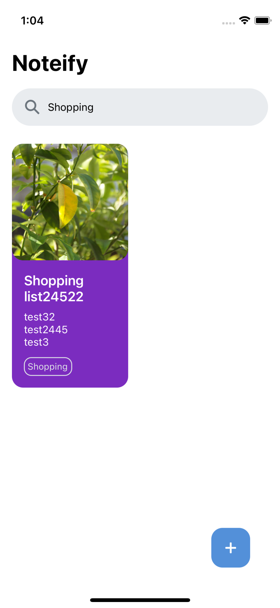
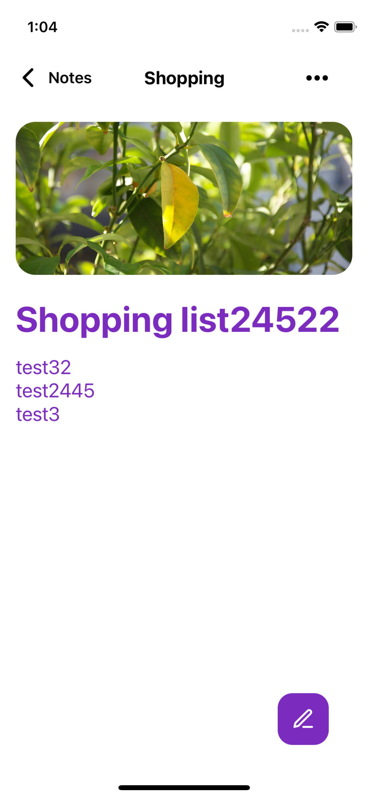
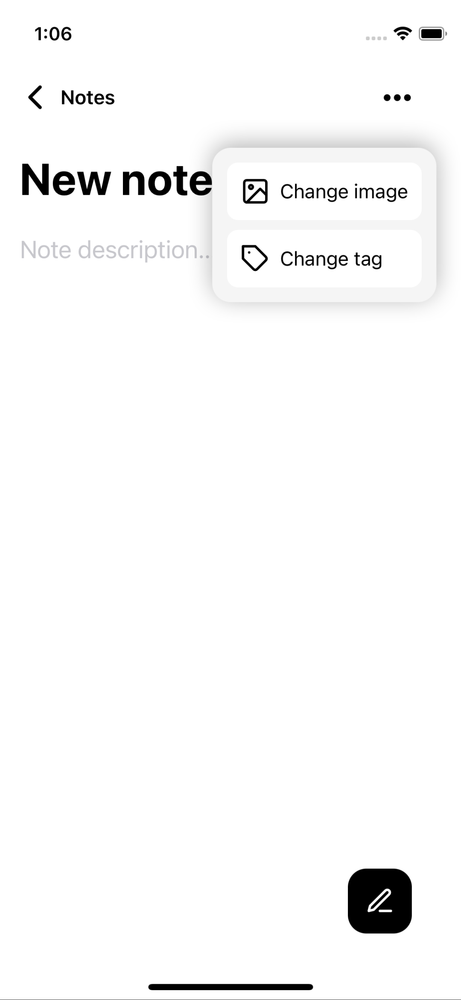
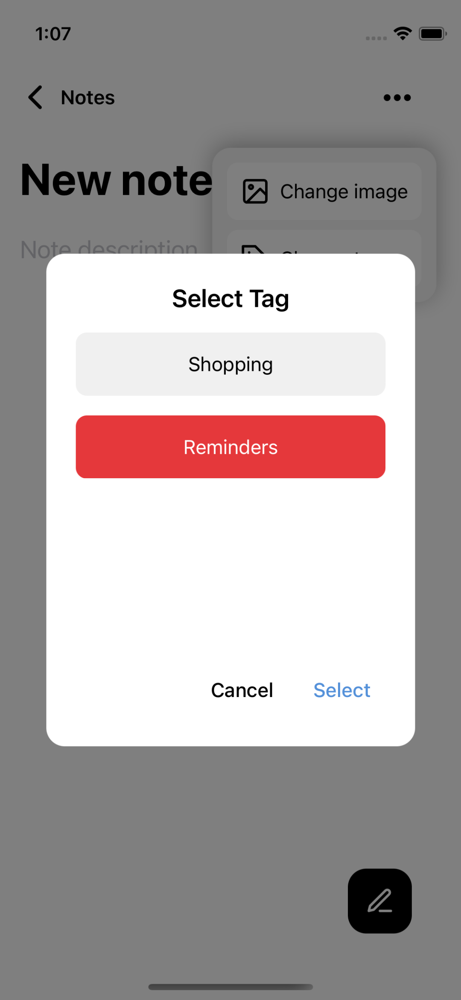

# NotesAppReactNative
Notes Mobile App made with React Native using Notes API.

The **Notes API** (see the Notes API repository) and also **Masonry Layout** was made from scratch.

The app has the following features
- Masonry Layout
- Add note
- Edit the features of a note (tag, image, title, description)
- Filter notes by description and title
- Change note image by selecting an image from your gallery

To add for next versions
- Ability to edit a tag
- Ability to add tags
- Ability to filter notes by tag

<b>Unfiltered notes list.</b>

 
 

<b>Filtered notes list.</b>

 
 

<b>Edit note screen.</b>

 
 

<b>Add note screen.</b>

 
 

<b>Change note tag pop-up.</b>

